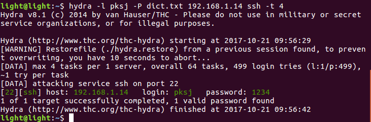
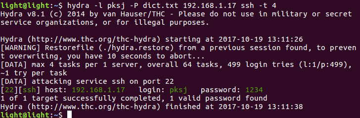
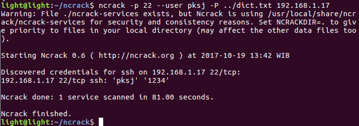

# Tugas 1
## Instalasi Virtual Box
1. Install virtual box
  
Jalankan code tersebut pada terminal anda. Namun, sebelumnya run command **sudo apt-get update** terlebih dahulu. lalu jalankan **sudo apt-get install virtualbox**.

## Instalasi Ubuntu Server
1. Memberi Nama Virtual Mesin  

2. Mengalokasikan Memori untuk Virtual Mesin

3. Membuat Virtual Hardisk  

4. Memilih Tipe Virtual Hardisk

5. Mengalokasikan Storage  

6. Memilih Mekanisme Alokasi Storage

7. Virtual Mesin telah Ditambahkan
  
klik **Start** untuk memulai instalasi

8. Pilih Image untuk Install Ubuntu Server  

9. Pilih Bahasa untuk Menu Instalasi Ubuntu   

10. Pilih Menu Install Ubuntu Server  

11. Pilih Bahasa untuk Ubuntu yang Kita Install

12. Pilih Lokasi
    1. Pilih Other
    
    2. Pilih Asia
    
    3. Pilih Indonesia
    
    
13. Pilih Locale

14. Pilih Keyboard
    1. Konfigurasi Keyboard
    
    Kita dapat menggunakan pilihan deteksi otomatis dengan memilih **yes**. Dalam instalasi ini kita akan memilih keyboard yang sudah ada maka kita memilih **no**.
    2. Pilih Negara Asal Keyboard
    
    3. Pilih Layout Keyboard
    

15. Isi Hostname untuk Ubuntu Server Kita  

16. Isi User Baru Ubuntu Server

17. Isi Username untuk User yang Baru Kita Buat

18. Isi Password untuk User yang Baru

19. Konfimarasi Password Baru

20. Apabila Password yang Kita Isikan Lemah, Kita Akan Mendapatkan Peringatan

21. Pilih Apakah Kita Ingin Mengenkripsi Folder Home atau Tidak

Dalam instalasi kali ini pilih **no**.

22. Konfirmasi Pengaturan Waktu Ubuntu Server

23. Konfigurasi Partisi  

Pada section ini kita memilih konfigurasi partisi. Kita pilih pilihan kedua jika tidak ingin mengkonfigurasi manual.

24. Memilih disk untuk partisi  

25. Konfirmasi Konfigurasi Partisi  

26. Setting Ukuran Partisi

27. Konfirmasi Partisi  

28. Instalasi Akan Berjalan  

29. Konfigurasi Proxy

30. Instalasi Akan Melakukan Setup Apt

31. Pilih Software yang Ingin Diinstal  

32. Instalasi Grub

33. Instalasi Selesai

34. Ubuntu Menyelesaikan Instalasi

**Instalasi Selesai.**

## Instalasi Ubuntu Desktop
1. Memberi Nama Virtual Mesin  
  

2. Mengalokasikan Memori untuk Virtual Mesin

3. Membuat Virtual Hardisk  

4. Memilih Tipe Virtual Hardisk

5. Mengalokasikan Storage  
  

6. Memilih Mekanisme Alokasi Storage

7. Virtual Mesin telah Ditambahkan

8. Menambahkan disk file ke Virtual Mesin  
  

9. Memulai Instalasi Ubuntu Desktop di Virtual Mesin
  
Klik **Install Ubuntu** untuk memulai instalasi

10. Persiapan Instalasi
  

11. Memilih jenis instalasi  
  

12. Membuat perubahan pada disk yang ingin diinstall  
  

13. Memilih Zona Waktu
  

14. Mengidentifikasi keyboard layout

15. Mengisikan username dan password

16. Proses Instalasi  
  
Tunggu hingga proses instalasi selesai.

17. Reboot

Setelah proses instalasi selesai, reboot dan ubuntu desktop siap digunakan.

## Install Open SSH server  
  
Install OpenSSH-server pada ubuntu desktop yang ada di virtual mesin. Namun, jalankan **sudo apt-get update** terlerbih dahulu. Lalu jalankan **sudo apt-get install openssh-server**

## Instalasi Tools Penetrasi
1. Install Hydra pada komputer

2. Install Ncrack
    - Download File Ncrack dari github   
      
    - Jalankan **./Configure**
    
    - Kemudian jalankan **make**
    
    - lalu jalankan **sudo make install** untuk menginstall ncrack
    
## Uji Penetrasi 1
1. Lakukan instalasi tools penetrasi
2. Download wordlist. Wordlist adalah daftar kata-kata yang kita gunakan untuk untuk melakukan bruteforce. Daftar kata-kata tersebut nantinya akan bertindak sebagai password.
3. Lakukan pengujian penetrasi
    ### Penetrasi Ubuntu Server
    1. Menggunakan Hydra
    
    2. Menggunakan Ncrack
    
    ### Penetrasi Ubuntu Desktop
    1. Menggunakan Hydra
    
    2. Menggunakan Ncrack
    
    
